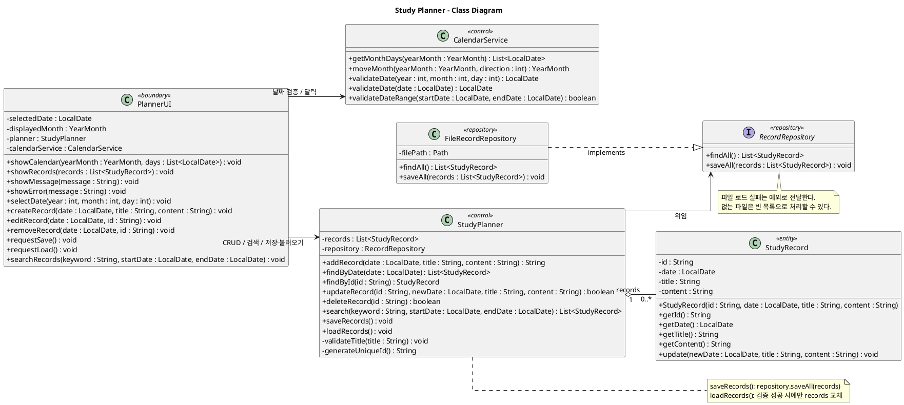

# Study Planner — Class Diagram (최신 UC-01~UC-09 반영)

## 1. Class Diagram — PlantUML

```plantuml
@startuml
title Study Planner - Class Diagram
skinparam classAttributeIconSize 0
skinparam linetype ortho
left to right direction

class PlannerUI <<boundary>> {
  - selectedDate : LocalDate
  - displayedMonth : YearMonth
  - planner : StudyPlanner
  - calendarService : CalendarService
  + showCalendar(yearMonth : YearMonth, days : List<LocalDate>) : void
  + showRecords(records : List<StudyRecord>) : void
  + showMessage(message : String) : void
  + showError(message : String) : void
  + selectDate(year : int, month : int, day : int) : void
  + createRecord(date : LocalDate, title : String, content : String) : void
  + editRecord(date : LocalDate, id : String) : void
  + removeRecord(date : LocalDate, id : String) : void
  + requestSave() : void
  + requestLoad() : void
  + searchRecords(keyword : String, startDate : LocalDate, endDate : LocalDate) : void
}

class CalendarService <<control>> {
  + getMonthDays(yearMonth : YearMonth) : List<LocalDate>
  + moveMonth(yearMonth : YearMonth, direction : int) : YearMonth
  + validateDate(year : int, month : int, day : int) : LocalDate
  + validateDate(date : LocalDate) : LocalDate
  + validateDateRange(startDate : LocalDate, endDate : LocalDate) : boolean
}

class StudyPlanner <<control>> {
  - records : List<StudyRecord>
  - repository : RecordRepository
  + addRecord(date : LocalDate, title : String, content : String) : String
  + findByDate(date : LocalDate) : List<StudyRecord>
  + findById(id : String) : StudyRecord
  + updateRecord(id : String, newDate : LocalDate, title : String, content : String) : boolean
  + deleteRecord(id : String) : boolean
  + search(keyword : String, startDate : LocalDate, endDate : LocalDate) : List<StudyRecord>
  + saveRecords() : void
  + loadRecords() : void
  - validateTitle(title : String) : void
  - generateUniqueId() : String
}

class StudyRecord <<entity>> {
  - id : String
  - date : LocalDate
  - title : String
  - content : String
  + StudyRecord(id : String, date : LocalDate, title : String, content : String)
  + getId() : String
  + getDate() : LocalDate
  + getTitle() : String
  + getContent() : String
  + update(newDate : LocalDate, title : String, content : String) : void
}

interface RecordRepository <<repository>> {
  + findAll() : List<StudyRecord>
  + saveAll(records : List<StudyRecord>) : void
}

class FileRecordRepository <<repository>> {
  - filePath : Path
  + findAll() : List<StudyRecord>
  + saveAll(records : List<StudyRecord>) : void
}

PlannerUI --> StudyPlanner : CRUD / 검색 / 저장·불러오기
PlannerUI --> CalendarService : 날짜 검증 / 달력
StudyPlanner "1" o-- "0..*" StudyRecord : records
StudyPlanner --> RecordRepository : 위임
FileRecordRepository ..|> RecordRepository : implements

note bottom of RecordRepository
  파일 로드 실패는 예외로 전달한다.
  없는 파일은 빈 목록으로 처리할 수 있다.
end note

note right of StudyPlanner
  saveRecords(): repository.saveAll(records)
  loadRecords(): 검증 성공 시에만 records 교체
end note
@enduml
```

